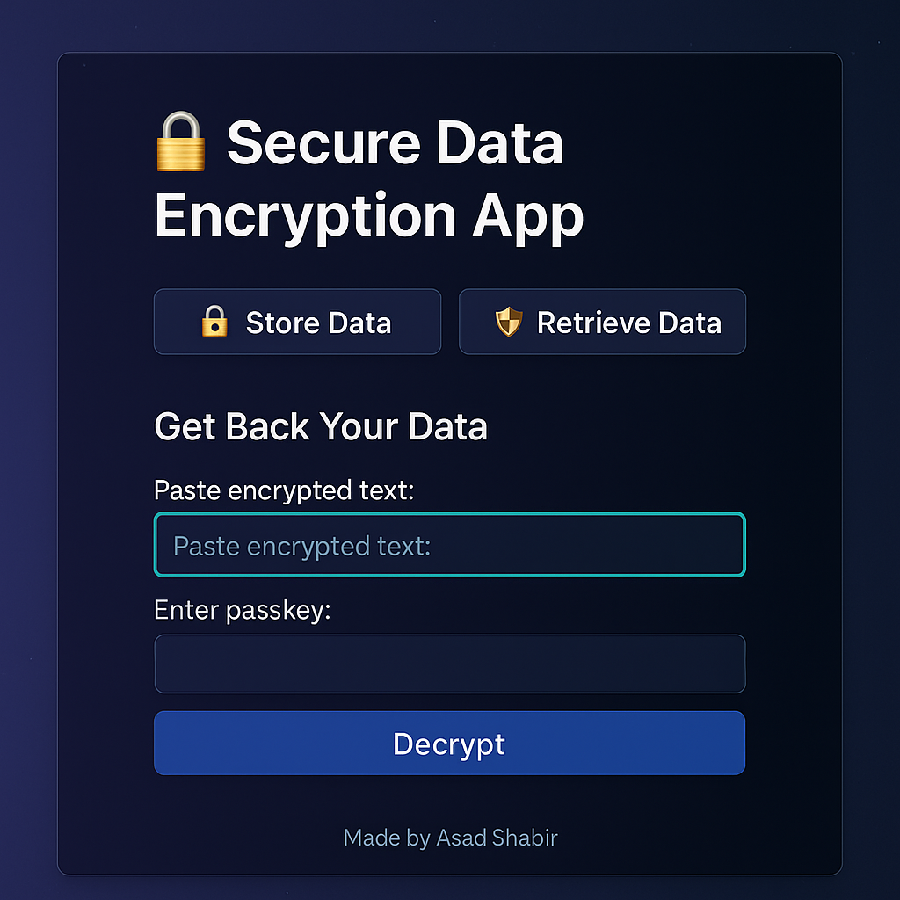

# 🔐 Secure Data Encryption App

**Made with ❤️ by Asad Shabir**

A beautiful, safe, and modern app to store and retrieve encrypted data using a secure passkey. Built with `Streamlit`, `cryptography`, and Python magic. 🚀

## 📦 Features
- 🔒 Secure encryption and decryption
- 🔑 Password-protected data retrieval
- 💾 Session-based memory
- 🎨 Stylish UI with colorful layout and emoji feedback
- 🧠 Educational and practical project

## 🖼️ Preview


## 🛠️ Tech Used
- Python 🐍
- Streamlit 📊
- cryptography 🔐
- Fernet key system 🔑

## 🚀 How to Run Locally
```bash
git clone https://github.com/asadshabir/Secure-data-encryption-app
cd secure-data-encryption-app
pip install -r requirements.txt
streamlit run app.py
